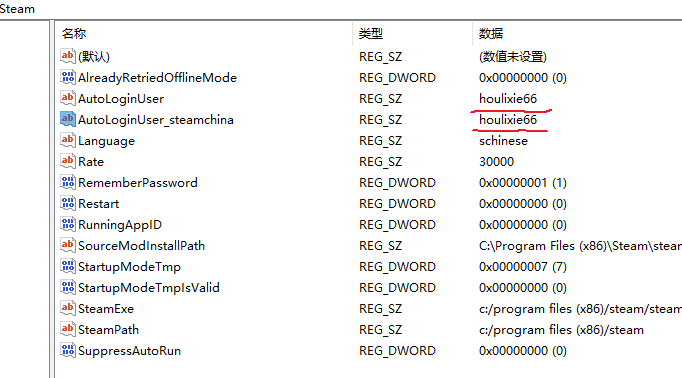
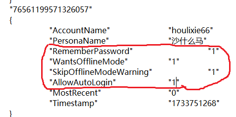

# 离线启动 Steam 游戏
目前即使在 steam 客户端中进入了离线模式,但切换账号后客户端后仍然会尝试登录,虽然物理断网可解,但是麻烦.为此我写了个脚本.与 Steam++ 加速器的"以离线模式启动"具有同等功效

获得游戏后,先下载完成,然后打开一次,最好再玩一会,之后进入离线模式,退出 Steam 客户端

修改注册表 `HKEY_CURRENT_USER\SOFTWARE\Valve\Steam` 修改这两个值



改成游戏拥有者的账户名,就是这里这个


然后修改 `C:\Program Files (x86)\Steam\config\loginusers.vdf` 文件,将指定账户的这些值统统改为`1`



这时双击 steam 图标启动,就直接是离线模式了. [steam_offline.py](./steam_offline.py) 就是以上步骤的自动化执行,比如我要玩欧卡2,就是这样
```bat
python .\steam_offline.py houlixie66 227300
```

`227300`是游戏ID,可以在地址栏查看

