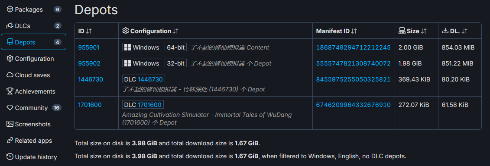
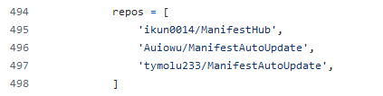
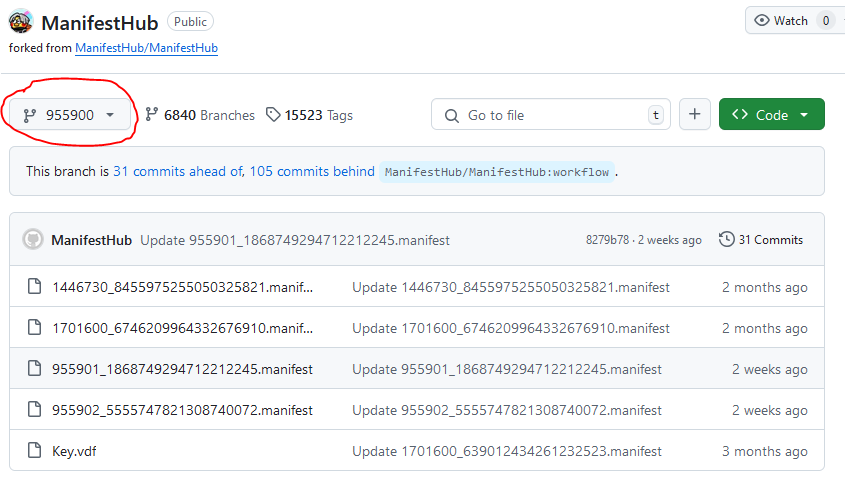
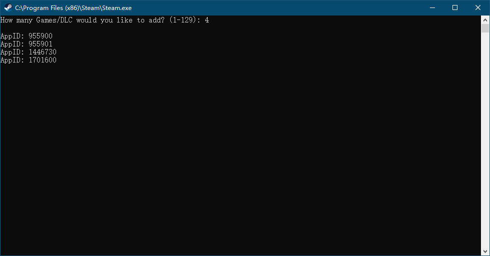
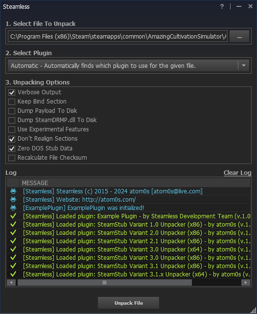

# Steam 假入库流程
1. 创建一个steam小号,可以使用[临时邮箱](https://www.linshigmail.com).以下使用游戏`了不起的修仙模拟器`为例进行说明
2. 获取游戏 ID `955900` ,然后访问 `https://steamdb.info/app/955900/depots/?branch=public` 得到 `Depots ID` 和 `Manifest ID`
    
3. `Depots` 是游戏的各个组成部分,一个已经安装正版游戏的账号, steam 会将 `Depots ID` 和其密钥记录在配置文件里.比如在 64 位 Windows 上, `C:\Program Files (x86)\Steam\config\config.vdf` 文件里就有如下字符串
    ```
    "depots"
    {
        "955901"
        {
            "DecryptionKey" "7A3F5A92B6422AF44C29C94BC4D54CB778EE157E58873E3E7B4E3FD4F25D3956"
        }
        "1446730"
        {
            "DecryptionKey" "DF4BFF2F0D54A794BA24B7FAA60D334CC2ABAF20D7EA625138D15A1BC6AC439D"
        }
        "1701600"
        {
            "DecryptionKey" "D358BBD50B412FD6CCD9A211041AAF9F0B8927F65D503C2026576162A2140DCC"
        }
    }
    ```
4. `Manifest` 文件记录了一个 `Depots` 的具体内容,每次游戏更新后,对应的 `Depots` 都会生产新的 `Manifest ID` ,它们存放在 `C:\Program Files (x86)\Steam\depotcache` 目录下,如`修仙模拟器`和他的2个`DLC`对应的文件分别是 `955901_1868749294712212245.manifest`,`1446730_8455975255050325821.manifest` 和 `1701600_6746209964332676910.manifest` .steam 在下载游戏前,会检查本地文件和密钥是否存在,不存在会从服务器下载,而假入库就是提前准备好这些文件,阻止 steam 请求服务器,因为一请求就露馅了
5. 以上文件需要从正版游戏里获得,有一些友善的论坛网友自发提供了自己购买的游戏 `DecryptionKey` 和 `Manifest` 文件,比如 [ikunshare/Onekey](https://github.com/ikunshare/Onekey/blob/main/main.py) 里的

    

    进入其中一个仓库对应的分支,就可以看到相关文件

    

6. 最重要的一步就是在 steam 中解锁游戏.不然即使下载好了游戏文件, steam 中也只会显示`购买`而非`开始游戏`.这里使用 [GreenLuma 2024 1.6.1](https://cs.rin.ru/forum/viewtopic.php?f=10&t=103709) 对 steam 进行注入.首先备份 steam 安装目录下的 `bin\x64launcher.exe` ,将论坛下载的压缩包解压后覆盖到安装目录,双击 `DLLInjector.exe`.输入要解锁的游戏ID和`DLC`ID(在 `AppList` 下创建文件效果一样)

    
7. 进入 steam 后,在地址栏中输入 `steam://install/955900` 开始安装,一般来说完成后就可以正常启动了,但有些游戏比如`修仙模拟器`会弹出 `application loaderror 6:0000065432` 的错误,此时需要使用 [Steamless](https://github.com/atom0s/Steamless) 对游戏启动器进行脱壳.下载后运行 `Steamless.exe` ,选择 `C:\Program Files (x86)\Steam\steamapps\common\AmazingCultivationSimulator\Amazing Cultivation Simulator.exe`

    

    点击 `Unpack File` 会在同目录生成一个后缀为 `unpacked.exe` 的程序,用它替换掉原来的 `exe` 游戏即可顺利运行