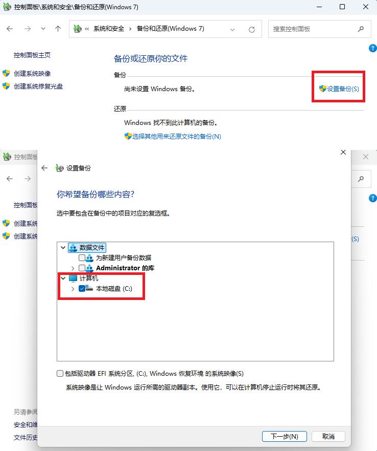

# Windows 的备份与还原
### 在线
* 手动备份

    

    后面按照向导操作
* 需要还原的机器如果可以正常启动,点击上图中的`选择其他用来还原文件的备份`
* 如果不能启动,则需要 启动 Windows 安装盘进入`Windows RE`环境,`疑难解答` -> `高级选项` -> `查看更多恢复选项` -> `系统映像恢复`
* 加入任务计划实现自动备份 EFI 分区, C 盘, D 盘到 E 盘
    ```powershell
    wbadmin start backup -backuptarget:e: -include:c:,d: -allcritical -quiet
    ```
### UWF
* 类似于 Linux 上的 OverlayFS ,系统运行期间所有对磁盘的写入均重定向到临时位置,重启即还原
    ```powershell
    dism /online /enable-feature /all /featurename:client-unifiedwritefilter
    uwfmgr filter enable
    ```
* 配置缓存区,重启生效
    ```powershell
    # disk 为硬盘, ram 为内存,非大内存者建议硬盘
    uwfmgr overlay set-type disk
    uwfmgr overlay set-passthrough on
    # 缓存大小为 20G ,超过自动重启.15G 警告, 18G 严重
    uwfmgr overlay set-size 20480
    uwfmgr overlay set-warningthreshold 15360
    uwfmgr overlay set-criticalthreshold 18432
    # 保护 C 盘,但用户目录下的修改会保存
    uwfmgr volume protect c:
    uwfmgr file add-exclusion c:\users
    # 查看配置
    uwfmgr get-config
    ```
### 全盘
```powershell
dism /capture-ffu /imagefile=d:\backup.ffu /capturedrive=\\.\physicaldrive0 /name:disk0 # 备份
dism /apply-ffu /imagefile=d:\backup.ffu /applydrive:\\.\physicaldrive0 # 还原
```
* 全盘备份与还原,包括 EFI 分区,C 盘和其它分区信息,不排除任何文件,但是不适用 MBR 分区硬盘
* 硬盘序号可用 `diskpart -> list disk` 查看
* 对刚安装完系统的硬盘进行备份,镜像大小约为 `11GB`
### 目录
```powershell
dism /capture-image /imagefile:d:\backup.wim /capturedir:c:\ /name:win10 /compress:max # 备份 C 盘
dism /append-image /imagefile:d:\backup.wim /capturedir:c:\ /name:win10_2 # 基于上次备份进行增量备份
dism /apply-image /imagefile:d:\backup.wim /index:1 /applydir:c:\ # 还原 C 盘的第一次备份
```
* 备份指定目录,比如 `C:\` ,但是子目录中的空目录无法被备份
### 修复启动项
```powershell
mountvol h: /s # 挂载 efi 分区到 H 盘
bcdboot c:\windows /s h: /f uefi # 修复 efi 启动项
#
diskpart -> sel dis 0 -> sel par 1-> active # 分区设为可启动
bcdboot c:\windows /s c: /f bios # 修复 bios 启动项
```
### 驱动
```powershell
# 驱动文件 C:\Windows\System32\DriverStore\FileRepository
dism /online /export-driver /destination:c:\drivers # 备份驱动到 c:\drivers
dism /online /add-driver /recurse /driver:c:\drivers # 从 c:\drivers 安装驱动