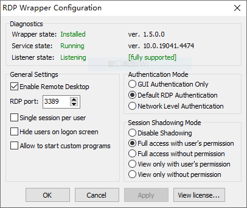
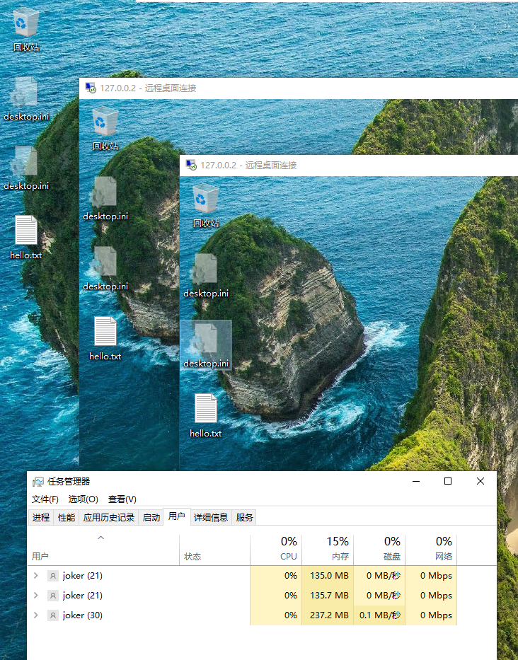

# Windows 远程桌面服务
### 远程桌面
1. 开启服务
    ```cmd
    reg add "HKLM\SYSTEM\CurrentControlSet\Control\Terminal Server" /t REG_DWORD /f /v fDenyTSConnections /d 0
    netsh advfirewall firewall set rule group="remote desktop" new enable=yes
    rem 在中文系统中,group="远程桌面"
    ```
2. 修改端口,重启服务
    ```cmd
    set port=9833
    reg add "HKLM\SYSTEM\CurrentControlSet\Control\Terminal Server\WinStations\RDP-Tcp" /t REG_DWORD /f /v PortNumber /d %port%
    netsh advfirewall firewall add rule name=RDP_Port dir=in action=allow protocol=TCP localport=%port%
    netsh advfirewall firewall add rule name=RDP_Port dir=in action=allow protocol=UDP localport=%port%
    net stop TermService /y
    net start TermService
    ```
### 远程应用
1. 启用
    ```cmd
    reg add "HKLM\SOFTWARE\Policies\Microsoft\Windows NT\Terminal Services" /t REG_DWORD /f /v fAllowUnlistedRemotePrograms /d 1
    ```
2. 客户端新建rdp文件
    ```rdp
    full address:s:YOUR_IP_HERE
    username:s:YOUR_USERNAME_HERE
    password 51:b:YOUR_PASSWORD_HASH_HERE
    remoteapplicationmode:i:1
    remoteapplicationprogram:s:C:\Windows\System32\cmd.exe
    devicestoredirect:s:*
    drivestoredirect:s:*
    redirectclipboard:i:1
    ```
    需要填写服务端的 ip 地址,用户名,`PASSWORD_HASH`为以下命令的输出
    ```powershell
    ConvertTo-SecureString "YOUR_PASSWORD_HERE" -AsPlainText -Force | ConvertFrom-SecureString
    ```
    要运行的应用以 `cmd.exe` 为例.双击 rdp 文件即可在本地显示远程服务器上的`cmd.exe`,支持剪切板和文件共享
### 多开
1. 使用 [RDP Wrapper Library](https://github.com/stascorp/rdpwrap) 可以在非`Server`系统上多开`RDP`.下载 [RDPWrap-v1.6.2.zip](https://github.com/stascorp/rdpwrap/releases/download/v1.6.2/RDPWrap-v1.6.2.zip) ,解压后运行 `install.bat` ,再下载最新的配置文件 [rdpwrap.ini](https://github.com/sebaxakerhtc/rdpwrap.ini/blob/master/rdpwrap.ini) 放到 `C:\Program Files\RDP Wrapper`
2. 运行 `RDPConf.exe` 进行相关配置,如果未即时生效可重启 `TermService` 服务.可以通过本机的 `127.0.0.2` 或其它主机同时登录多个用户多次

    

    
