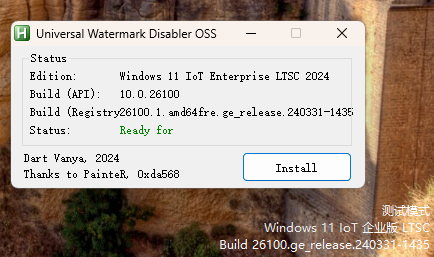
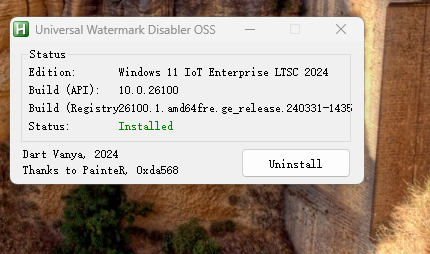

# 移除测试模式水印
1. 启用测试模式: `bcdedit /set testsigning on`
2. 下载运行 [uwd-oss](https://github.com/0xda568/uwd-oss) ,刷新一下水印就没了

     
3. 原理是劫持了 `C:\Windows\System32\explorerframe.dll` 的 `ExtTextOutW` 函数,具体可参考 [Universal-Watermark-Disabler-Reverse-Engineering](https://github.com/0xda568/Universal-Watermark-Disabler-Reverse-Engineering)
4. 在不进入测试模式的前提下加载未签名驱动可以使用 [KDMapper](https://github.com/TheCruZ/kdmapper) ,但是限制太多,需要定制驱动源代码