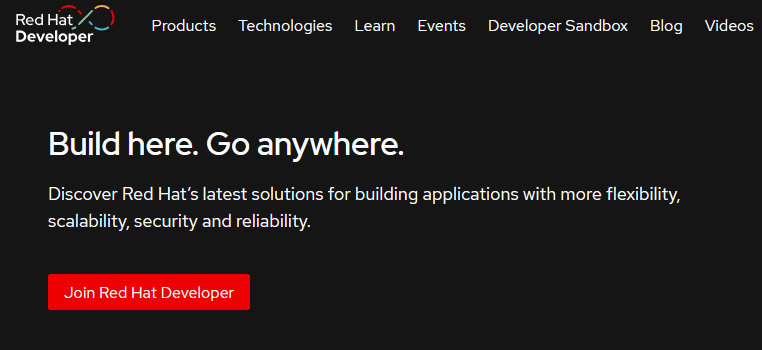
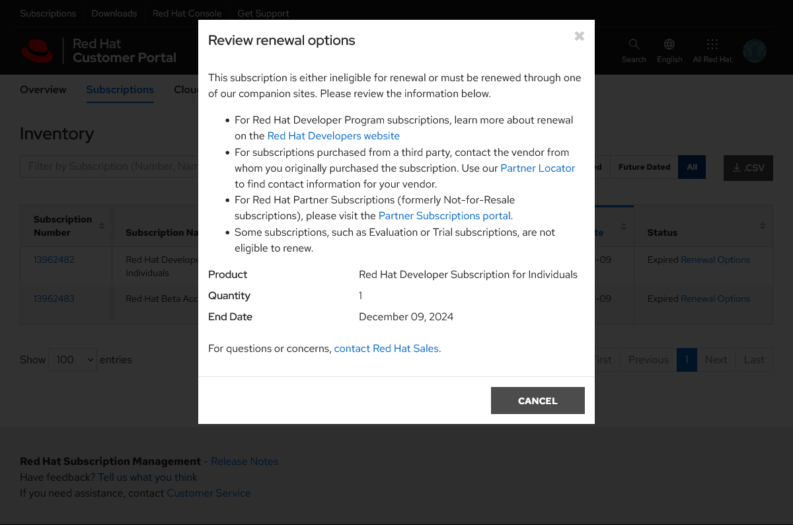

# 同步 RHEL 软件仓库
1. 进入[红帽开发者网站](https://developers.redhat.com/)(非红帽官网) ,点击 `Join Red Hat Developer` 注册账号.要填的东西挺多,但其实只验证邮箱
    
2. 镜像下载[地址](https://developers.redhat.com/products/rhel/download),账号每年免费续订[地址](https://access.redhat.com/management/subscriptions)(虽然可能会和我一样续订失败),通过[这里](https://console.redhat.com/insights/inventory)管理已注册的系统
    
3. 通过容器同步仓库, `username` 和 `password` 为登录网站的账号密码,以下 `dnf repolist --all` 列出所有仓库用于同步,可以将 `--all` 换成 `--enabled` 只同步已经启用的仓库
    ```bash
    cat > dockerfile <<"EEE"
    FROM registry.access.redhat.com/ubi9
    RUN subscription-manager register --auto-attach --username uuuuu --password ppppp
    CMD /bin/sh -c "while :; do dnf repolist --all | awk '\$1 ~ /-/ {print \$1}' | xargs -IT dnf reposync --download-path /opt/rhel --download-metadata --newest-only --repo T; sleep 86400; done"
    EEE

    docker build -t rhel9_repos .
    docker run -d --restart=always -v /mnt/rhel9_repos:/opt/rhel rhel9_repos
    # python3 -m http.server 80 -d /mnt/rhel9_repos
    ```
4. 移除服务器上的红帽订阅,启用本地仓库
    ```bash
    cp /etc/yum.repos.d/redhat.repo{,.ori}
    dnf remove -y subscription-manager
    
    readarray -d '' s < <(sed 's/^\[/\x0\[/' /etc/yum.repos.d/redhat.repo.ori)
    for((i=1;i<${#s[@]};i++)); do
        while read -r l; do
            if [[ "$l" =~ ^\[(.*)\]$ ]]; then
                # 原样输出 [rhel-9-for-x86_64-baseos-rpms] 
                t="${BASH_REMATCH[1]}"
                echo "$l"
            elif [[ "$l" =~ ^[[:space:]]*(#|$) ]]; then
                # 忽略注释和空行
                continue
            elif [[ "$l" =~ ^(name|enabled)" =" ]]; then
                # name 和 enabled 字段原样输出
                echo "$l"
            elif [[ "$l" =~ ^baseurl" =" ]]; then
                # 将 baseurl 换成本地仓库地址
                echo "baseurl = http://192.168.xx.xx/$t"
            else
                # 忽略其它字段
                :
            fi
        done <<< "${s[i]}"
        echo 'gpgcheck = 0'
        echo
    done > /etc/yum.repos.d/redhat.repo
    ```