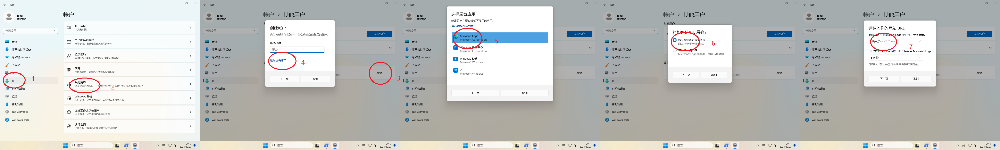
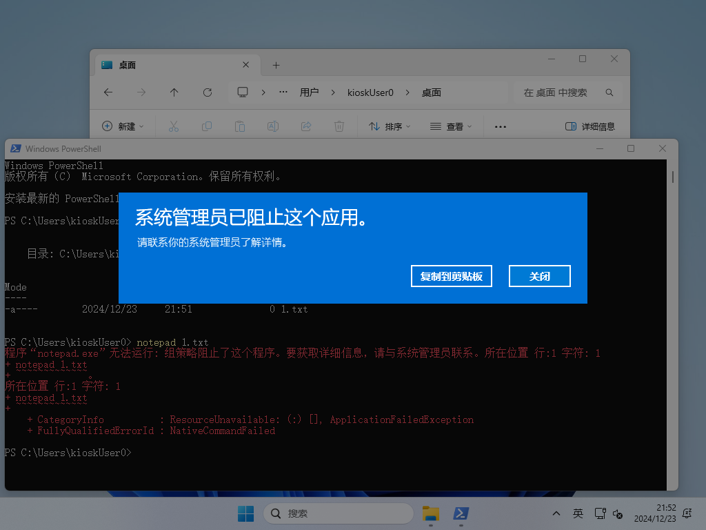

# Kiosk 演示模式
### Rocky 9
1. 安装图形界面和 `kiosk` 相关脚本
    ```bash
    dnf groupinstall -y "Server with GUI"
    systemctl set-default graphical.target
    dnf install -y gnome-kiosk-script-session
    ```
    部署应用,并新建一个普通用户 `hellokitty`
2. 配置用户自动登录,修改 `/etc/gdm/custom.conf` 文件,添加
    ```
    [daemon]
    AutomaticLoginEnable=True
    AutomaticLogin=hellokitty
    ```
3. 配置用户以 `kiosk` 模式登录 , 修改 `/var/lib/AccountsService/users/hellokitty` 的
    ```
    [User]
    Session=gnome-kiosk-script
    ```
4. 新建可执行脚本 `/home/hellokitty/.local/bin/gnome-kiosk-script` ,用于启动应用,以 `firefox` 为例
    ```bash
    #!/bin/sh
    while sleep 1; do
        firefox --kiosk --private-window https://www.163.com
    done
    ```
### Windows 11 IoT
1. 正常安装系统和应用,新建一个非管理员用户
2. 如图所示,第4步选择用户,第5步选择 `Edge` 或 `UWP` 应用,注销后登录新建的用户即可
    
3. 若想将任意应用设置成 `Kiosk` 模式,参考 [使用 Shell 启动器配置展台体验](https://learn.microsoft.com/zh-cn/windows/configuration/assigned-access/shell-launcher/quickstart-kiosk?tabs=ps) ,需新建配置文件 `config.xml` ,内容如下
    ```xml
    <?xml version="1.0" encoding="utf-8"?>
    <ShellLauncherConfiguration xmlns="http://schemas.microsoft.com/ShellLauncher/2018/Configuration" xmlns:V2="http://schemas.microsoft.com/ShellLauncher/2019/Configuration">
        <Profiles>
            <DefaultProfile>
                <Shell Shell="%SystemRoot%\explorer.exe"/>
            </DefaultProfile>
            <Profile Id="{1e731e7d-600e-4c09-9cb6-bc3164def42a}">
                <Shell Shell="%SystemRoot%\notepad.exe" V2:AppType="Desktop" V2:AllAppsFullScreen="true">
                    <ReturnCodeActions>
                        <ReturnCodeAction ReturnCode="0" Action="RestartShell"/>
                        <ReturnCodeAction ReturnCode="-1" Action="RestartDevice"/>
                        <ReturnCodeAction ReturnCode="255" Action="ShutdownDevice"/>
                    </ReturnCodeActions>
                    <DefaultAction Action="RestartShell"/>
                </Shell>
            </Profile>
        </Profiles>
        <Configs>
            <Config>
                <AutoLogonAccount/>
                <Profile Id="{1e731e7d-600e-4c09-9cb6-bc3164def42a}"/>
            </Config>
        </Configs>
    </ShellLauncherConfiguration>
    ```
    功能是将用户 shell 从 `explorer.exe` 替换为 `notepad.exe` ,登录系统就会看到一个全屏的记事本,没有任务栏和菜单,并根据应用结束状态决定重启设备还是应用, 其中 `Profile Id` 用 `New-Guid` 命令生成,确保每个配置文件互不相同
    ```ps1
    $conf = Get-Content -Path config.xml
    $o = Get-CimInstance -Namespace "root\cimv2\mdm\dmmap" -ClassName "MDM_AssignedAccess"
    $o.ShellLauncher = [System.Net.WebUtility]::HtmlEncode($conf)
    Set-CimInstance -CimInstance $o
    ```
    以 `system` 权限安装配置文件.然后注销当前用户,登录界面会发现多了一个叫 `展台` 的用户,登录他
4. 多应用模式,有任务栏和开始菜单,但只能运行规定的几个应用,参考 [使用分配的访问权限配置受限的用户体验](https://learn.microsoft.com/zh-cn/windows/configuration/assigned-access/quickstart-restricted-user-experience?tabs=ps&pivots=windows-11),配置文件如下
    ```xml
    <?xml version="1.0" encoding="utf-8"?>
    <AssignedAccessConfiguration xmlns="http://schemas.microsoft.com/AssignedAccess/2017/config" xmlns:rs5="http://schemas.microsoft.com/AssignedAccess/201810/config" xmlns:v3="http://schemas.microsoft.com/AssignedAccess/2020/config" xmlns:v5="http://schemas.microsoft.com/AssignedAccess/2022/config">
    <Profiles>
        <Profile Id="{e5fde3df-7167-4ea9-8e15-bd1f85624c6b}">
        <AllAppsList>
            <AllowedApps>
            <App DesktopAppPath="%windir%\System32\WindowsPowerShell\v1.0\Powershell.exe" />
            <App DesktopAppPath="%windir%\explorer.exe" />
            <App AppUserModelId="%ProgramFiles(x86)%\Microsoft\Edge\Application\msedge.exe" />
            </AllowedApps>
        </AllAppsList>
        <rs5:FileExplorerNamespaceRestrictions>
            <rs5:AllowedNamespace Name="Downloads" />
            <v3:AllowRemovableDrives />
        </rs5:FileExplorerNamespaceRestrictions>
        <v5:StartPins><![CDATA[{
                        "pinnedList":[
                            {"desktopAppLink":"%APPDATA%\\Microsoft\\Windows\\Start Menu\\Programs\\Windows PowerShell\\Windows PowerShell.lnk"},
                            {"desktopAppLink":"%APPDATA%\\Microsoft\\Windows\\Start Menu\\Programs\\File Explorer.lnk"},
                            {"desktopAppLink": "%ALLUSERSPROFILE%\\Microsoft\\Windows\\Start Menu\\Programs\\Microsoft Edge.lnk"}
                        ]
                    }]]></v5:StartPins>
        <Taskbar ShowTaskbar="true" />
        </Profile>
    </Profiles>
    <Configs>
        <Config>
        <AutoLogonAccount rs5:DisplayName="Demacia" />
        <DefaultProfile Id="{e5fde3df-7167-4ea9-8e15-bd1f85624c6b}" />
        </Config>
    </Configs>
    </AssignedAccessConfiguration>
    ```
    指定运行 `explorer`, `edge` 和 `powershell` ,并且可以读写`Downloads`文件夹和U盘,安装的命令也有一点不一样
    ```ps1
    $conf = Get-Content -Path config.xml
    $o = Get-CimInstance -Namespace "root\cimv2\mdm\dmmap" -ClassName "MDM_AssignedAccess"
    $o.Configuration = [System.Net.WebUtility]::HtmlEncode($conf)
    Set-CimInstance -CimInstance $o
    ```
    