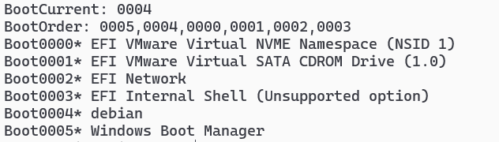
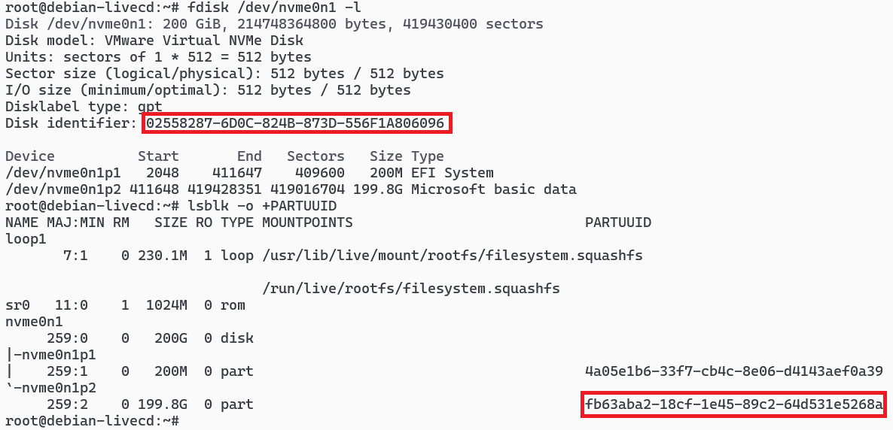
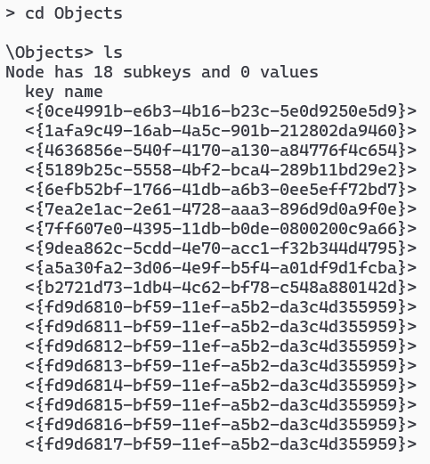
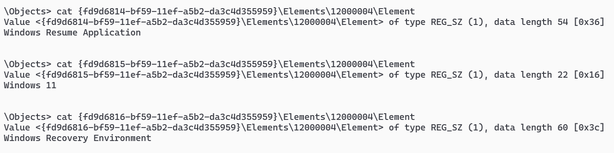
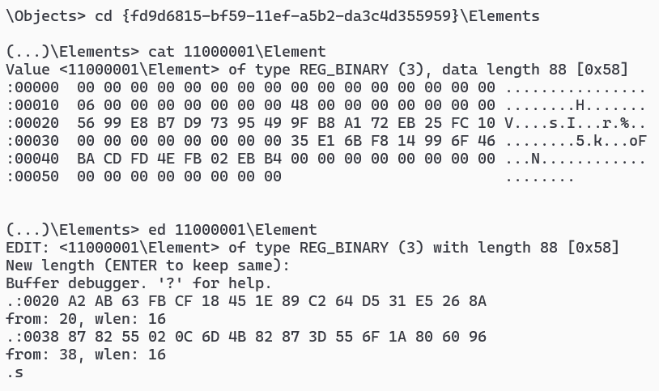

# 系统一键重装
### 提问
在不依赖网络,U盘和光驱,无人工参与的前提下,如何替换掉当前正在运行的操作系统?
* 在硬盘空间富余的情况下,就地安装双系统,进入第二系统删除原系统完成替换
* 否则重启进入 `PE/LiveCD` ,删除原系统再安装新系统,在安装过程中需要另一个分区存放安装镜像
* 内存空间大于8G的话,可以将安装镜像放入内存,如此可以全格硬盘

以下以UEFI固件为例说明.
### Windows to Windows
1. 准备好 Windows 11 的安装镜像 `C:\win11.iso` ,同时将制作好的PE镜像解压到 `C:\pe`
2. 将PE加入开机启动项
    ```cmd
    rem 创建内存盘对象
    bcdedit /create {ramdiskoptions} /d "Windows PE"
    bcdedit /set {ramdiskoptions} ramdisksdidevice partition=C:
    bcdedit /set {ramdiskoptions} ramdisksdipath \pe\boot\boot.sdi
    rem 创建启动项
    for /f "tokens=2 usebackq" %i in (`bcdedit /create /application osloader /d "Windows Installation"`) do set osid=%i
    bcdedit /set %osid% device ramdisk=[C:]\pe\sources\boot.wim,{ramdiskoptions}
    bcdedit /set %osid% osdevice ramdisk=[C:]\pe\sources\boot.wim,{ramdiskoptions}
    bcdedit /set %osid% path \windows\system32\winload.efi
    bcdedit /set %osid% systemroot \windows
    bcdedit /set %osid% detecthal yes
    bcdedit /set %osid% winpe yes
    bcdedit /set %osid% nx optin
    rem 开机启动pe
    bcdedit /displayorder %osid% /addlast
    bcdedit /default %osid%
    bcdedit /timeout 5
    ```
3. 移植 [ImDisk](https://sourceforge.net/projects/imdisk-toolkit/) 到PE中,用于创建内存盘,有多个分区可省略此步
    ```cmd
    rem 解压安装包
    extrac32.exe /e /l .\f files.cab
    md .\t
    dism /mount-image /imagefile:c:\pe\sources\boot.wim /index:1 /mountdir:.\t
    rem 复制文件
    copy .\f\driver\awealloc\amd64\awealloc.sys .\t\windows\system32\drivers
    copy .\f\driver\deviodrv\amd64\deviodrv.sys .\t\windows\system32\drivers
    copy .\f\driver\sys\amd64\imdisk.sys .\t\windows\system32\drivers
    copy .\f\driver\cli\amd64\imdisk.exe .\t\windows\system32
    copy .\f\driver\cpl\amd64\imdisk.cpl .\t\windows\system32
    copy .\f\driver\cli\i386\imdisk.exe .\t\windows\syswow64
    copy .\f\driver\cpl\i386\imdisk.cpl .\t\windows\syswow64
    rem 导入注册表
    reg load hklm\pe .\t\windows\system32\config\system
    regedit /s .\imdisk.reg
    reg unload hklm\pe
    dism /unmount-image /mountdir:.\t /commit
    ```
    其中`imdisk.reg`内容如下
    ```reg
    Windows Registry Editor Version 5.00

    [HKEY_LOCAL_MACHINE\pe\ControlSet001\Services]

    [HKEY_LOCAL_MACHINE\pe\ControlSet001\Services\AWEAlloc]
    "Type"=dword:00000001
    "Start"=dword:00000003
    "ErrorControl"=dword:00000000
    "ImagePath"=hex(2):5c,00,53,00,79,00,73,00,74,00,65,00,6d,00,52,00,6f,00,6f,00,\
      74,00,5c,00,73,00,79,00,73,00,74,00,65,00,6d,00,33,00,32,00,5c,00,44,00,52,\
      00,49,00,56,00,45,00,52,00,53,00,5c,00,61,00,77,00,65,00,61,00,6c,00,6c,00,\
      6f,00,63,00,2e,00,73,00,79,00,73,00,00,00
    "DisplayName"="AWE Memory Allocation Driver"
    "Description"="Driver for physical memory allocation through AWE"

    [HKEY_LOCAL_MACHINE\pe\ControlSet001\Services\DevIoDrv]
    "Type"=dword:00000001
    "Start"=dword:00000003
    "ErrorControl"=dword:00000000
    "ImagePath"=hex(2):5c,00,53,00,79,00,73,00,74,00,65,00,6d,00,52,00,6f,00,6f,00,\
      74,00,5c,00,73,00,79,00,73,00,74,00,65,00,6d,00,33,00,32,00,5c,00,44,00,52,\
      00,49,00,56,00,45,00,52,00,53,00,5c,00,64,00,65,00,76,00,69,00,6f,00,64,00,\
      72,00,76,00,2e,00,73,00,79,00,73,00,00,00
    "DisplayName"="DevIO Client Driver"
    "Description"="Client driver for ImDisk devio proxy mode"

    [HKEY_LOCAL_MACHINE\pe\ControlSet001\Services\ImDisk]
    "Type"=dword:00000001
    "Start"=dword:00000002
    "ErrorControl"=dword:00000000
    "ImagePath"=hex(2):5c,00,53,00,79,00,73,00,74,00,65,00,6d,00,52,00,6f,00,6f,00,\
      74,00,5c,00,73,00,79,00,73,00,74,00,65,00,6d,00,33,00,32,00,5c,00,44,00,52,\
      00,49,00,56,00,45,00,52,00,53,00,5c,00,69,00,6d,00,64,00,69,00,73,00,6b,00,\
      2e,00,73,00,79,00,73,00,00,00
    "DisplayName"="ImDisk Virtual Disk Driver"
    "Description"="Disk emulation driver"
    ```
4. 启动脚本`C:\init_pe.bat`内容如下,它由PE启动后调用
    ```cmd
    if not exist "x:\89757.bat" (
        copy /y "%~f0" "x:\89757.bat"
        start cmd /c "x:\89757.bat"
        exit /b
    )
    
    rem 装载 iso 到内存
    for %%i in (C D E F G H I J K L M N O P Q R S T U V) do if exist %%i:\win11.iso (
        imdisk -a -m w: -o awe -f %%i:\win11.iso
        goto :break_loop
    )
    :break_loop
    
    rem 全格第一块硬盘,分两个区,EFI 盘符 Y ,系统盘符 Z
    (
        echo select disk 0
        echo clean
        echo convert gpt
        echo create partition efi size=200
        echo format fs=fat32 quick
        echo assign letter y
        echo create partition primary
        echo format fs=ntfs quick
        echo assign letter z
    ) | diskpart
    rem 安装系统,使用应答文件效果更佳
    dism /apply-image /imagefile:w:\sources\install.wim /index:1 /applydir:z:\
    bcdboot z:\windows /s y: /f uefi
    wpeutil reboot
    ```
### Windows to Linux
1. 安装 [grub4dos-for_UEFI](https://github.com/chenall/grub4dos/releases/tag/for_UEFI) 用于引导 Linux 安装镜像
    ```cmd
    cd grub4dos-for_UEFI-2024-12-16
    mountvol R: /S
    md R:\EFI\grub
    copy /y BOOTX64.EFI R:\EFI\Boot\
    copy /y menu.lst R:\EFI\grub\
    bcdedit /set "{bootmgr}" path \EFI\Boot\BOOTX64.EFI
    ```
2. 将自制的LiveCD `debian.iso` 放在C盘根目录下,注意制作时在 `chroot` 阶段需要安装 `ntfs-3g` 用于访问 Windows 分区.以此修改 `R:\EFI\grub\menu.lst` 内容如下
    ```
    timeout 5
    default 0

    title Debian 12
    find --set-root /debian.iso
    map /debian.iso (0xff)
    map --hook
    root (0xff)
    kernel /live/vmlinuz boot=live toram findiso=/debian.iso
    initrd /live/initrd

    title Windows 11
    find --set-root /efi/Microsoft/boot/bootmgfw.efi
    chainloader /efi/Microsoft/boot/bootmgfw.efi

    title reboot
    reboot
    ```
3. 将待安装的 Linux 镜像同样放在C盘根目录,重启进入 LiveCD 后,先挂载C盘,将镜像解压到 `/dev/shm` ,然后安装,最后修复启动项,过程与前面类似,略
### Linux to Linux
将 LiveCD 镜像放在根目录下,修改 grub 然后重启进入 LiveCD 进行安装
```bash
echo 'menuentry "debian.iso" {
    set iso="/debian.iso"
    loopback loop (hd0,2)$iso
    linux (loop)/live/vmlinuz boot=live toram findiso=$iso
    initrd (loop)/live/initrd
}' >> /etc/grub.d/40_custom

sed -i 's/^GRUB_DEFAULT=.*/GRUB_DEFAULT=saved/' /etc/default/grub
grub-set-default debian.iso
grub-mkconfig -o /boot/grub/grub.cfg
```
### Linux to Windows
1. 将 `Debian 12` 系统替换为 `Windows 11` ,需要准备以下工具,全部放到根目录下
    * `debian.iso` 镜像,安装了 `ntfs-3g`, `wimtools`, `efibootmgr`, `chntpw`, `fdisk`, `dosfstools`
    * `Windows 11` 的安装镜像里的 `install.wim` ,位于iso的 `sources` 目录下
    * 任意运行 `Windows 11` 的主机 `EFI` 分区下的 `BCD` 文件,位于 `\EFI\Microsoft\Boot`
2. 如前法重启至 `debian.iso` ,复制原系统根目录下的 `install.wim` 和 `BCD` 到 `/dev/shm` ,然后格盘
    ```bash
    mount --mkdir /dev/nvme0n1p2 /mnt/nvme0n1p2
    cp -fv /mnt/nvme0n1p2/{BCD,install.wim} /dev/shm/
    umount /mnt/nvme0n1p2
    dd if=/dev/zero of=/dev/nvme0n1 bs=1M count=10
    # 第一个分区大小 200M ,类型为 EFI ,剩下的容量归第二个分区,类型为 Microsoft basic data
    echo 'g,n,,,+200M,t,1,n,,,,t,,11,p,w,' | tr ',' '\n' | fdisk /dev/nvme0n1
    # 分别格式化为 fat32 和 ntfs
    mkfs.vfat -F32 /dev/nvme0n1p1
    mkfs.ntfs -f /dev/nvme0n1p2
    ```
3. 安装系统和EFI启动项
    ```bash
    wimapply /dev/shm/install.wim 1 /dev/nvme0n1p2
    mount --mkdir /dev/nvme0n1p1 /mnt/nvme0n1p1
    mount --mkdir /dev/nvme0n1p2 /mnt/nvme0n1p2
    mkdir -p /mnt/nvme0n1p1/EFI/Microsoft
    cp -rf /mnt/nvme0n1p2/Windows/Boot/EFI /mnt/nvme0n1p1/EFI/Microsoft/Boot
    cp -f /dev/shm/BCD /mnt/nvme0n1p1/EFI/Microsoft/Boot

    efibootmgr -c -d /dev/nvme0n1 -L "Windows Boot Manager" -l /EFI/Microsoft/Boot/bootmgfw.efi
    efibootmgr -b 4 -B
    ```
    添加Windows启动项,以我的虚拟机为例,删除第4个

    
4. 准备修改BCD文件,使 `bootmgfw.efi` 能找到 `Windows` 分区,相关内容参考 [Fixing device UUIDs in BCD under Linux](https://gist.github.com/Moondarker/2c5b7ed1c6372119ebf03f0b12d11e92) ,分别执行 `fdisk /dev/nvme0n1 -l` 和 `lsblk -o +PARTUUID` ,记下它们的输出

    

5. 编辑BCD文件 `chntpw -e /mnt/nvme0n1p1/EFI/Microsoft/Boot/BCD`
    * 列出子项,我的长这样

        

    * 遍历每一项的 `Elements\12000004\Element` 内容,找到 `Windows 11`

        

    * 进入 `Windows 11` 所在的子项,编辑 `11000001\Element` 和 `21000001\Element` 的内容,以 `11000001` 为例

        
        
        在我的文件中, `0020` 处是 `lsblk` 得到的分区uuid, `0038` 处是 `fdisk` 得到的硬盘uuid,比如原字符串为 `fb63aba2-18cf-1e45-89c2-64d531e5268a` ,则在文件中存储的顺序为 `A2 AB 63 FB CF 18 45 1E 89 C2 64 D5 31 E5 26 8A` .在 `21000001` 中做同样的修改后, `q` 退出 `y` 保存
6. 重启进入 Windows