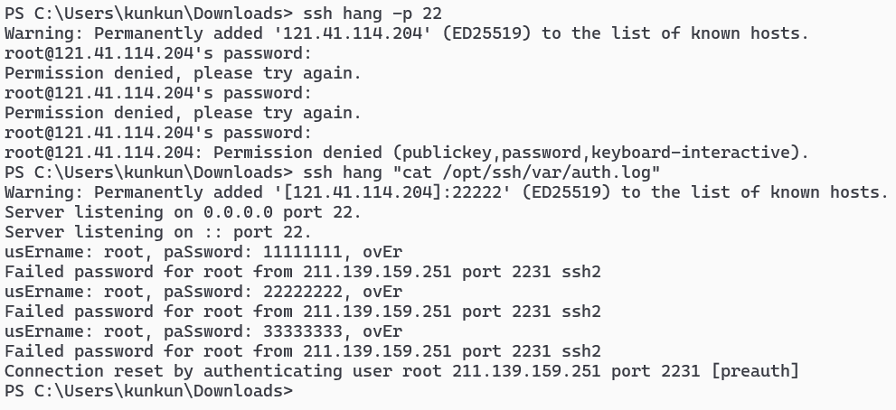

# ssh 蜜罐
1. 编译 `OpenSSH` ,使之记录用户登录时使用的账号和密码
    ```bash
    # 首先编译 zlib
    dest=/opt/ssh
    wget https://zlib.net/zlib-1.3.1.tar.gz
    tar xf zlib-1.3.1.tar.gz; cd zlib-1.3.1/
    ./configure --static --prefix=$dest
    make && make install; cd ..

    # 然后编译 ssl
    wget https://www.openssl.org/source/openssl-3.4.0.tar.gz
    tar xf openssl-3.4.0.tar.gz; cd openssl-3.4.0/
    ./config -static --libdir=lib --prefix=$dest
    make && make install; cd ..

    # 编译 ssh
    wget https://mirror.leaseweb.com/pub/OpenBSD/OpenSSH/portable/openssh-9.9p1.tar.gz
    tar xf openssh-9.9p1.tar.gz; cd openssh-9.9p1/
    # 记录用户名和密码
    sed -i '80i\\tlogit("usErname: %s, paSsword: %s, ovEr", authctxt->user, password);' auth-passwd.c
    export CFLAGS="-I$dest/include/" LDFLAGS="-L$dest/lib/"
    ./configure --with-ldflags=-static --prefix=$dest --with-privsep-user=nobody --with-privsep-path="$dest/var/empty"
    make && make install; cd ..
    ```
2. 在docker中运行
    ```bash
    docker run --restart=always -dv /opt/ssh:/opt/ssh -p 22:22 debian:12 /opt/ssh/sbin/sshd -DE /opt/ssh/var/auth.log
    ```
3. 登录一下试试

    