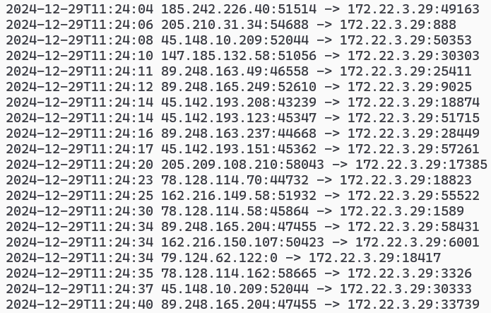

# nftables 的常用配置
### 基本配置
```bash
# 不同系统配置文件位置不同,可以通过 systemctl cat nftables.service 查看
apt install nftables
echo '#!/usr/sbin/nft -f
flush ruleset
table inet filter {
    chain input {
        type filter hook input priority filter; policy drop;
        iif "lo" accept
        ct state vmap { invalid : drop, established : accept, related : accept }
        ip protocol icmp icmp type echo-request ct state new accept
        tcp dport { 22, 80, 443 } accept
    }

    chain output {
        type filter hook output priority filter; policy accept;
    }

    chain forward {
        type filter hook forward priority filter; policy accept;
    }
}' > /etc/nftables.conf
systemctl enable nftables.service --now
```
* 开机生效,只开放 tcp 的 22,80,443 端口,允许 ping ,其它入站流量全部拒绝
* 列出现有配置 `nft list ruleset`
### 配置 NAT 和端口转发
```bash
nft add table nat
nft add chain nat postrouting { type nat hook postrouting priority srcnat \; policy accept \; }
nft add rule nat postrouting ip saddr 192.168.100.0/24 oif eth0 masquerade
```
* 等同于 `iptables -t nat -A POSTROUTING -s 192.168.100.0/24 -o eth0 -j MASQUERADE`
* `iptables` 改为 `iptables-translate` 可以将 iptables 命令行转为 nft 命令行
```bash
nft add table nat
nft add chain nat prerouting { type nat hook prerouting priority dstnat \; policy accept\; }
nft add rule nat prerouting tcp dport 22 redirect to 2222 # 本地转发
nft add rule nat prerouting iif eth0 tcp dport { 80, 443 } dnat to 123.45.67.89 # 异地转发
```
### 记录端口扫描
```bash
# 给从 eth0 进入的连接的首个数据包打上标记
nft add rule inet filter input iif eth0 ct state new log prefix \"SCAN: \"
# 查看记录结果,默认记录在内核中
journalctl --since "2024-12-22" --until "2024-12-29" --system --no-tail | grep SCAN
# 为了便于分析,将记录转存到日志文件中
apt install rsyslog
echo ':msg,regex,"IN=.*OUT=.*SRC=.*DST=.*" -/var/log/nftables.log' > /etc/rsyslog.d/nftables.conf
systemctl restart rsyslog
# 超过 10M 切割日志
echo '/var/log/nftables.log {
    size 10M
    rotate 3
    compress
    missingok
    dateext
    sharedscripts
    postrotate
        /usr/bin/systemctl kill -s HUP rsyslog.service
    endscript
}' > /etc/logrotate.d/nftables
```
分析日志文件
```bash
awk '/SCAN:/{
    d=substr($0,0,19)
    match($0,"SRC=[0-9.]+")
    src=substr($0,RSTART+4,RLENGTH-4)
    match($0,"SPT=[0-9]+")
    spt=substr($0,RSTART+4,RLENGTH-4)
    match($0,"DST=[0-9.]+")
    dst=substr($0,RSTART+4,RLENGTH-4)
    match($0,"DPT=[0-9]+")
    dpt=substr($0,RSTART+4,RLENGTH-4)
    print(d" "src":"spt" -> "dst":"dpt)
}' /var/log/nftables.log
```
我在阿里云上的服务器一分钟大概有 `30~40` 个扫描


### 控制进程流量
某进程 pid 为 996 ,丢弃它发送的所有流量
```bash
mkdir /sys/fs/cgroup/net_cls
mount -t cgroup -onet_cls net_cls /sys/fs/cgroup/net_cls
mkdir /sys/fs/cgroup/net_cls/balabala
echo 33 > /sys/fs/cgroup/net_cls/balabala/net_cls.classid # 33为分组
echo 996 > /sys/fs/cgroup/net_cls/balabala/tasks
nft add rule inet filter output meta cgroup 33 counter drop
```
### 远程调试
```bash
# 10 分钟后清空防火墙规则
systemd-run --unit=debug_nft --on-active=600s --timer-property=AccuracySec=100ms nft flush ruleset
# 取消清空
systemctl stop debug_nft.timer
```