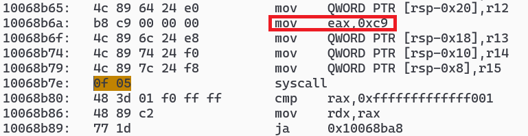
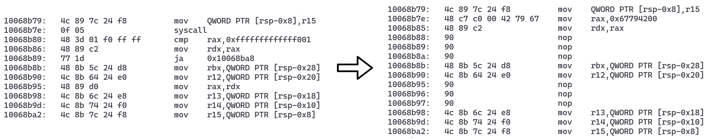

# 打包 Linux 二进制文件
### ldd
1. 以htop为例,找到它依赖的动态库,对于更复杂的程序,可能还需要找齐动态库依赖的动态库
    ```bash
    mkdir ./lib
    ldd /usr/bin/htop | {
        echo '/lib64/ld-linux-x86-64.so.2'
        echo '/usr/bin/htop'
        grep -Po '(?<==> ).*(?= \()'
    } | xargs -I{} -- cp -vf {} ./lib/
    ```
2. 复制 `./lib` 到目标机器后执行
    ```bash
    ./lib/ld-linux-x86-64.so.2 --library-path ./lib ./lib/htop
    ```
3. 也可使用 `patchelf` 直接修改二进制文件中的相关路径
    ```bash
    patchelf --set-rpath "$PWD/lib" --set-interpreter "$PWD/lib/ld-linux-x86-64.so.2" ./lib/htop
    ```
### [exodus](https://github.com/intoli/exodus)
1. 制作安装包
    ```bash
    pip install exodus-bundler
    exodus --tarball --output ./htop.tgz htop
    ```
2. 将生成的`htop.tgz`复制到目标机器解压即可
### [ermine](https://www.magicermine.com/trial.html)
1. 打包`./ErmineProTrial.x86_64 /usr/bin/htop --output=./htop`,打包好的程序只能使用1个月,到期后只能充值或调整系统时间
2. 用gdb动态调整时间戳到试用期内(2025-01-04 22:13:20)破解之
    ```bash
    gdb -batch \
        -ex 'catch syscall time' \
        -ex 'run' \
        -ex 'continue' \
        -ex 'set $rax=1736000000' \
        -ex 'delete 1' \
        -ex 'continue' \
        -ex 'quit' \
        --args ./htop
    ```
3. 或者直接修改二进制文件.先反编译文件 `objdump -M intel -D ./htop` ,定位 `rax` 为时间相关的 `syscall` 的位置

    

    然后在编辑器定位到 `00068b80` 进行修改,将时间戳写入文件,完成后是这样

    

    最后文件中搜索`%s: was packed with Ermine`和`%s: license will expire`等字符串,将第一个字符替换为 00
### docker
以上方法只能打包二进制文件但缺少环境变量和配置文件,可以借助 docker 进行打包
```dockerfile
FROM ruby:3
RUN echo 'puts "Hello World!"' > /h.rb
```
打包(导出)镜像
```bash
docker build -f ruby.dockerfile -t ruby-test .
docker create --name ruby-test-image ruby-test
docker export ruby-test-image -o ruby-test.tar
docker rm ruby-test-image
```
复制到目标机器解包运行,不一定需要 docker
```bash
tar xf ./ruby-test.tar -C /opt/ruby_app
mount -Brm / /opt/ruby_app/old_rootfs
unshare --mount-proc -R /opt/ruby_app ruby /h.rb
```