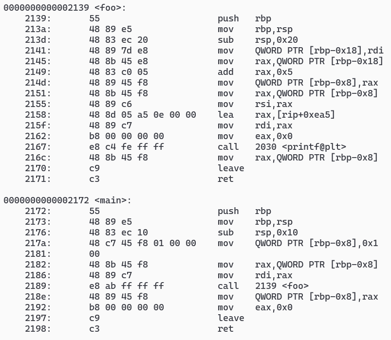
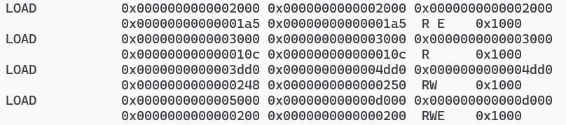
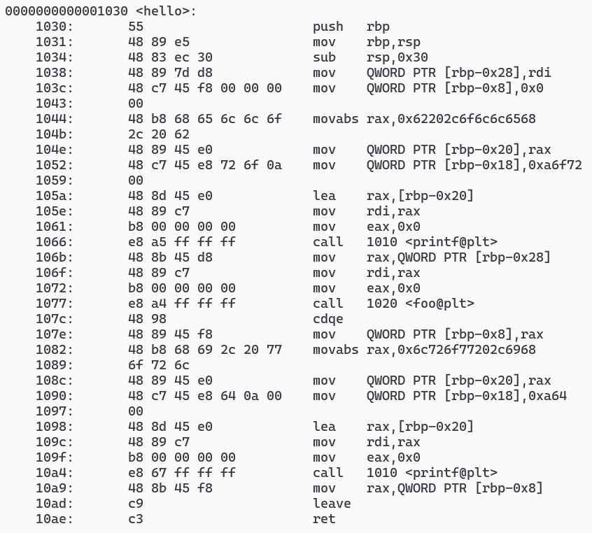

# 静态注入 elf
1. 由以下代码编译得到 `a.out` ,要求在无源码的情况下修改二进制文件,使之在打印结果前后输出被注释的内容
    ```c
    #include <stdio.h>

    long foo(long x) {
        long y = x + 5;
        // printf("hello, bro\n");
        printf("%ld\n", y);
        // printf("hi, world\n");
        return y;
    }

    int main() {
        long a = 1;
        a = foo(a);
        return 0;
    }
    ```
2. 使用 [lief](https://github.com/lief-project/LIEF) ,给 `a.out` 插入一个空白新段,生成 `b.out`
    ```py
    import lief

    b = lief.parse("a.out")
    s = lief.ELF.Segment()
    s.type = lief.ELF.Segment.TYPE.LOAD
    s.flags = lief.ELF.Segment.FLAGS.R | lief.ELF.Segment.FLAGS.W | lief.ELF.Segment.FLAGS.X
    s.content = [0] * 500
    s = b.add(s)

    b.write("b.out")
    ```
3. 节选 `objdump -M intel -D b.out` 如下

    
    
4. 可知新段在文件中的位置为 `0x5000` ,加载到内存中的位置为 `0xd000` .而因为 `main:2189` 中的跳转距离由 `0x2139 - 0x218e` 得到,所以跳转距离应改为 `0xd000 - 0x218e` ,即 `e8 72 ae 00 00`
5. 编译如下代码 `gcc -nostdlib -nodefaultlibs -fPIC -Wl,-shared xxx.c -o empty` 为机器指令,用于替换插入的空指令
    ```c
    long hello(long x) {
        long y = 0;
        unsigned long a[2];

        // hello, bro
        // echo hello, bro | xxd -g8 -e
        a[0] = 0x62202c6f6c6c6568;
        a[1] = 0x000a6f72;
        printf((char *)a);

        y = foo(x);

        // hi, world
        a[0] = 0x6c726f77202c6968;
        a[1] = 0x000a64;
        printf((char *)a);

        return y;
    }
    ```
    部分机器指令,只需依照步骤4分别修改 `call printf` 和 `call foo` 处的指令为 `e8f54fffff`, `e8ed50ffff` 和 `e8b74fffff`
    
6. 将以上机器码写入 `b.out` 的 `0x5000` 处