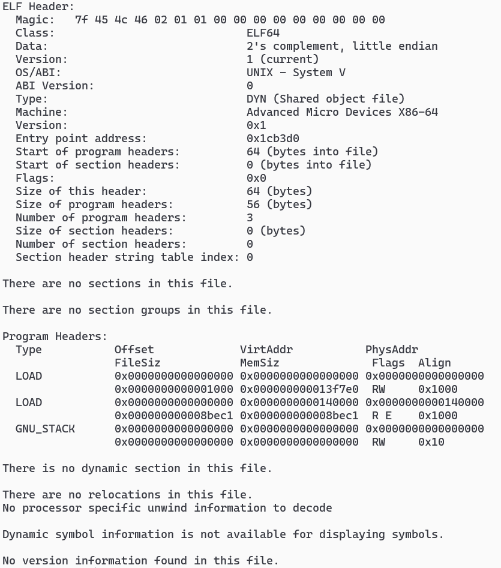
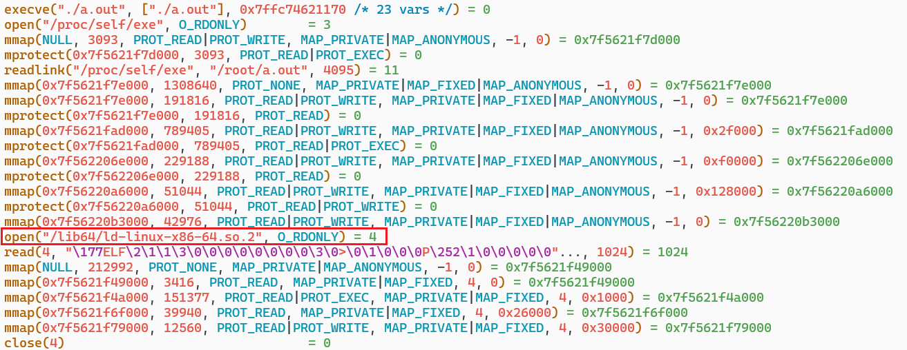
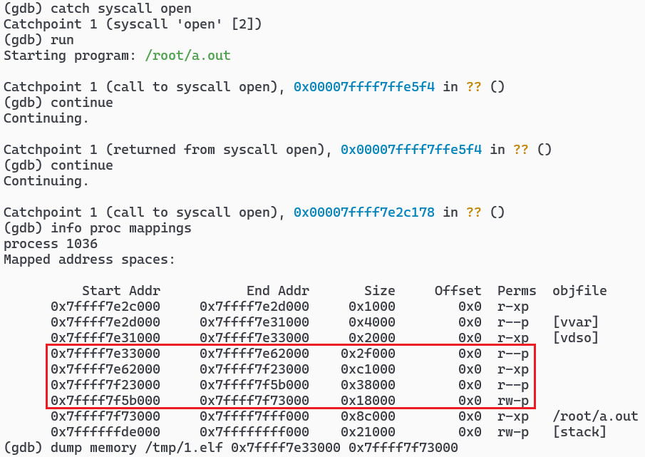

# gdb 重建脱壳镜像
1. 有一个疑似被 upx 压缩过的程序,因为无法使用 `upx -d` 脱壳,所以打算 dump 出内存重建其镜像. `readelf -a` 信息如下

    
2. 先执行 `strace ./a.out` 看看,开头长这样

    
3. 由上可知为程序为动态链接,换 gdb ,在该处下断点,因为此时 elf 已经解压但还没有被 ld 修改

    
4. 据推测红框处就是原文件在内存中的布局,可以通过 `0x7ffff7e33000` 处的 `7f454c46` 证明.镜像保存在 `/tmp/1.elf` ,可以正常运行,但是节名和节头表需要手动重建