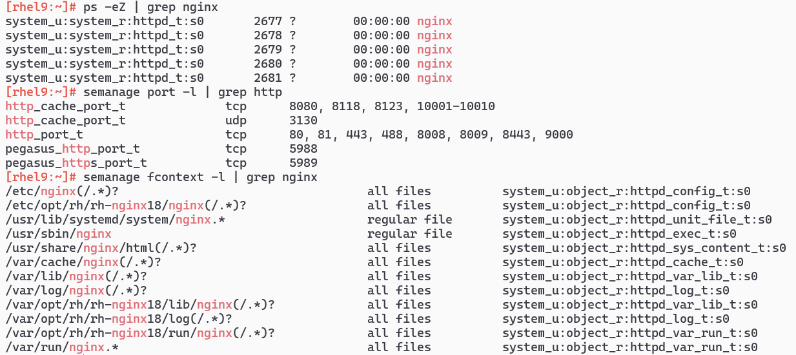

# selinux 常用配置
### 重新启用
1. 本篇内容基于 `RHEL 9` ,其它发行版可能会有所不同.初始 SELinux 状态为 `disabled`
2. 修改 `/etc/selinux/config` 内容为 `SELINUX=permissive`, `SELINUXTYPE=targeted` .然后重启,系统在启动过程中会重新标记文件
3. 检查 `/var/log/audit/audit.log` ,找到 `AVC` 和 `SELINUX` 相关字样的日志,一一除错
4. 确定各项服务运行正常以后,新建 `/.autorelabel` 文件再次重启标记文件
5. 进入系统确认无故障后执行 `setenforce 1` ,同时修改 `/etc/selinux/config` 的 `SELINUX=enforcing`
### 更改标签
1. Linux 用户在控制台的行为默认为 `unconfined_t` ,即无限制,所以无须多加关注.在 `targeted` 模式下, `SELinux` 默认只会限制大部分已知的系统服务(由 systemd 管理),用户自定义的服务同样为 `unconfined_service_t` ,亦无须多加关注
2. 以 nginx 为例,安装管理工具 `dnf install -y policycoreutils-devel policycoreutils-python-utils setroubleshoot-server` ,查看 nginx 的服务的标签 `httpd_t` ,允许使用的端口 `http_port_t` 和文件

    
3. 添加允许使用的端口 `semanage port -a -t http_port_t -p tcp 9090`, `-a` 改为 `-d` 是删除
4. 添加允许使用的文件 `semanage fcontext -a -e /var/www "/opt(/.*)?"`, `-e` 为复制标签到新目录
5. 重新标记目录 `restorecon -Rv /opt/` ,一般和上一条命令合用
### 限制自定义应用
1. 新建一个 web 应用
    ```bash
    mkdir /opt/fooo; cd $_
    echo '#!/bin/bash
    /usr/bin/python3 -m http.server 34567 --directory "$(dirname "$0")"
    ' > app.sh
    chmod +x ./app.sh
    echo "<h1>You can't have your cake and eat it too!</h1>" > index.html

    echo '[Unit]
    Description=Simple python app
    [Service]
    Type=simple
    ExecStart=/opt/fooo/app.sh
    [Install]
    WantedBy=multi-user.target
    ' > /usr/lib/systemd/system/fooo_app.service
    ```
2. 初始化规则
    ```bash
    cd ~
    sepolicy generate -n fooo_app --init /opt/fooo/app.sh -w /usr/lib/systemd/system/fooo_app.service /opt/fooo
    ./fooo_app.sh
    semanage permissive -a fooo_app_t
    ```
3. 正常使用应用,观察被拒绝的请求日志,允许其中的部分或全部
    ```bash
    systemctl start fooo_app
    ausearch -m AVC,USER_AVC -ts recent -su fooo_app | audit2allow -R >> fooo_app.te
    # echo 'type fooo_app_port_t;
    # corenet_port(fooo_app_port_t)
    # allow fooo_app_t fooo_app_port_t:tcp_socket name_connect;' >> fooo_app.te
    ./fooo_app.sh
    # semanage port -a -t fooo_app_port_t -p tcp 34567
    semanage permissive -d fooo_app_t
    ```