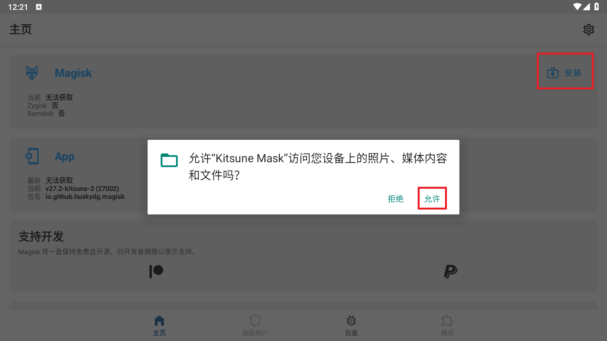
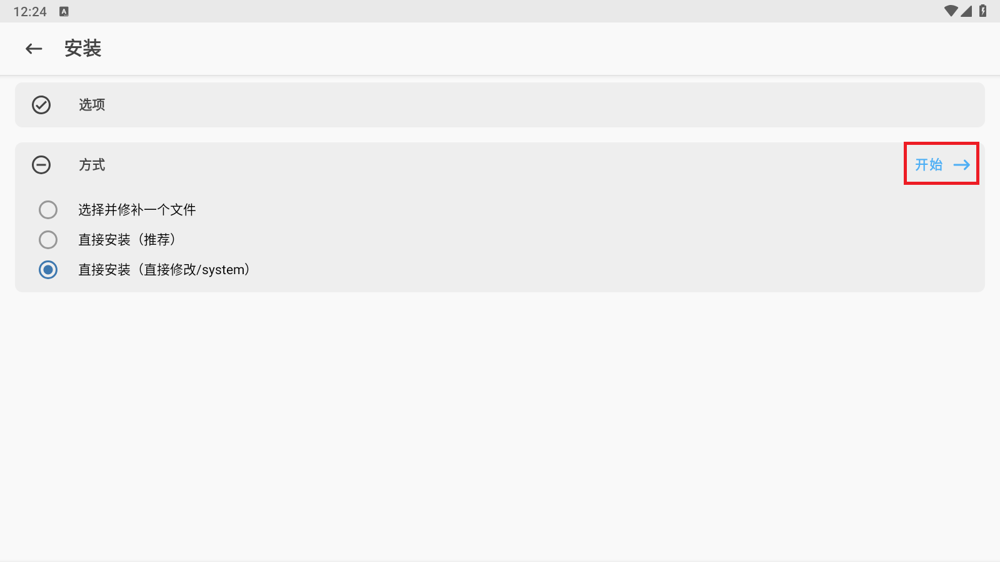
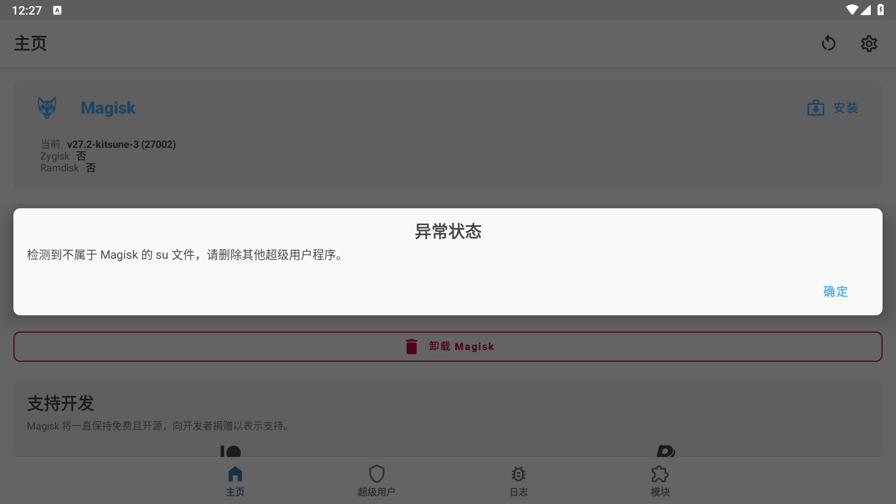
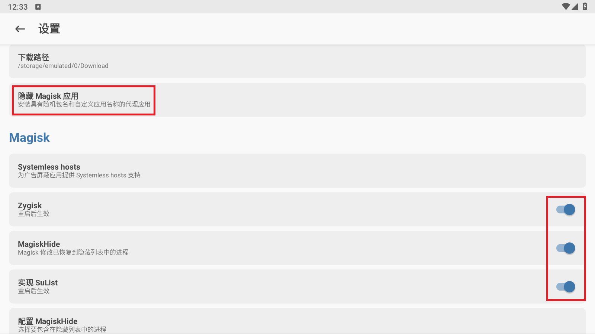

# 雷电模拟器安装面具
1. 模拟器设置中,启用 `磁盘 -> System.vmdk可写入`和`其他 -> ROOT权限`
2. 安装运行[Kitsune Magisk](https://github.com/1q23lyc45/KitsuneMagisk/releases),允许ROOT权限,点击`安装`和`允许`,重启后再点击下一步
    
    
3. 再次重启模拟器,进入`文件管理器`删除 `/system/xbin/su` ,否则打开面具会有如下报错,虽也无伤大雅就是了
    
4. 右上角齿轮开启以下4项,第1个是通过更改包名隐藏面具自身,后面3个是给指定应用提权且对其他应用隐藏
    