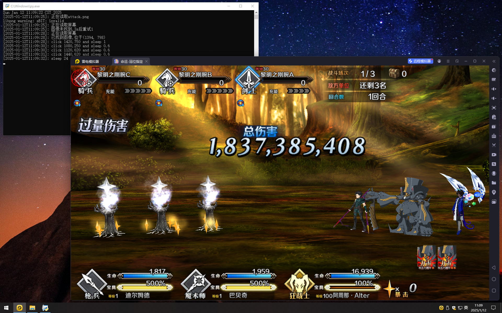

# BGO, 启动!
1. 运行环境为 `Windows + 雷电模拟器`,需要预先安装 `python`, 模拟器启用 adb 调试
    ```powershell
    pip install uiautomator2 paddlepaddle paddleocr opencv-python
    ```
2. 在阵容强大的情况下刷本使用[正常刷本.py](./正常刷本.py),设置好技能和宝具,轻松三回合,AP不足自动吃苹果
3. 练度不够或没钱氪金的情况下先下载安装[天雾科技](https://tieba.baidu.com/p/8205750753?see_lz=1),选中 `MaxNp` ,`一键五宝`,`技能满级`,攻击倍数 `5000` 就够用了,再使用[开挂.py](./开挂.py).不确定科技的安全性,不建议大号和氪金号使用
4. 买完友情点后可以使用[搓丸子](./搓丸子.py)脚本从抽友情池开始自动搓丸子,只搓到20级,`20~50`和`50~100`只能手搓,非不能也,实不为也.全都让脚本干这游戏也没必要玩了
5. 手游太费钱转战 Steam 了,退坑留个纪念.只适配了 `1600x900` 的分辨率,脚本中各个参数都写死了,因此只有参考价值没有实际意义

