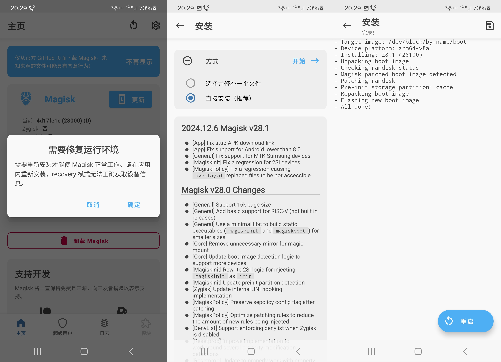

# 三星 S22 刷 Magisk
1. 手机型号 `Samsung Galaxy S22 SM-S9010` ,处理器 `Qualcomm Snapdragon 8 Gen 1` ,如图启用开发者选项

    
2. 下载手机驱动 [Samsung USB Driver](https://developer.samsung.com/android-usb-driver) ,安装包下载工具 [Frija](https://github.com/SlackingVeteran/frija/releases) 和刷机工具 [Odin3](https://dl2018.sammobile.com/Odin.zip) ,安装驱动后连接手机,运行 `Frija` 下载 `SM-S9010_xxx.zip` ,解压得到一堆 tar 包

    
3. 因为[原版面具](https://github.com/topjohnwu/Magisk)会使手机在激活时报错 `[2002] -45` ,所以这里使用[修改版面具](https://github.com/fei-ke/Magisk)对 `AP_xxx.tar.md5` 进行修补,得到 `magisk_xxx.tar`

    
4. `开发者选项`中启用`OEM解锁`,重启手机,按住上下音量键直到出现三国警告,再长按音量上键解锁 `BootLoader`

    

5. 手机进入 `OOBE` 后手动重启进入上图所示界面,短按音量上键进入刷机模式.打开 `Odin` ,分别选择 `BL`, `CP`, `CSC` 对应的 tar 包, `HOME` 包用不着, `USERDATA` 留空, `AP` 选择 `magisk_xxx.tar` ,点击 `Start` .若重启过程中遇到 `Can't load Android system` 选择 `Factory data reset`

    
6. 进入系统后卸载原来的 `Magisk` 换上原版面具

    