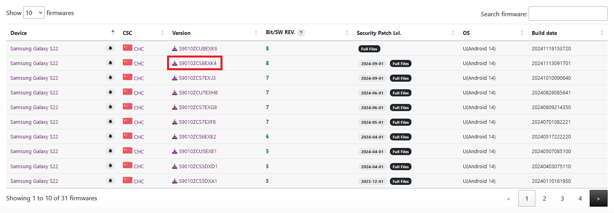
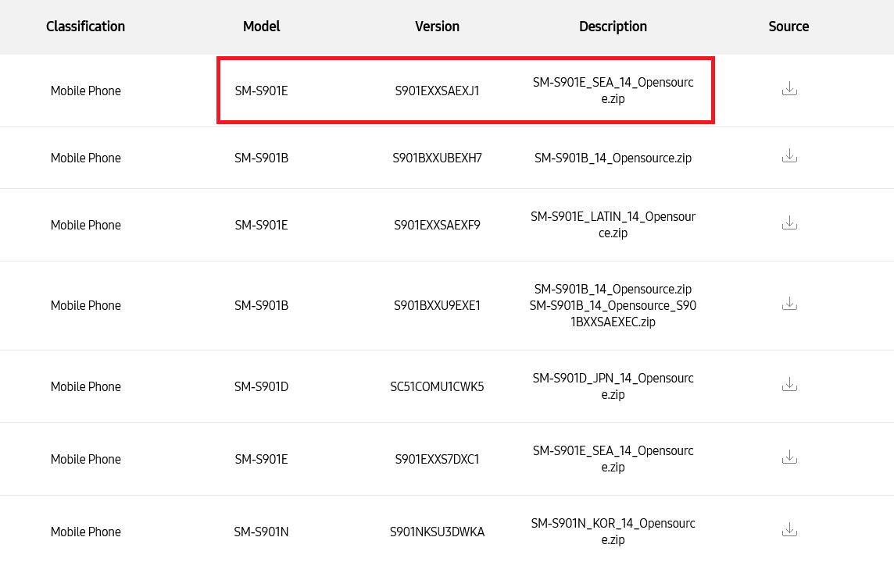
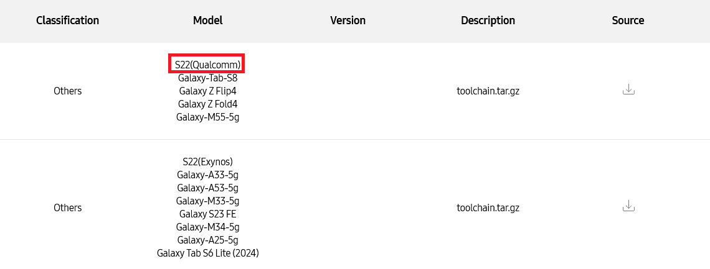
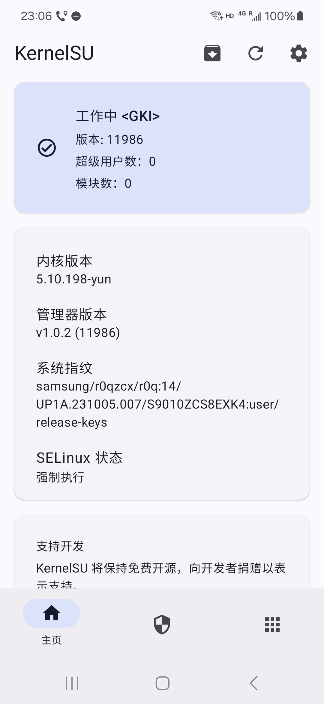

# S22 内核编译
1. 准备 `Debian 12` 编译环境,安装以下工具
    ```bash
    apt install -y build-essential python3 python-is-python3 zip xz-utils bison flex libz-dev libssl-dev libelf-dev bc cpio git
    ```
2. 在 [Samsung Open Source](https://opensource.samsung.com/uploadSearch) 中搜索 `SM-S901` 下载内核源码.处理器型号要相同,内核版本号要和手机上正在运行的内核一致,至于是国行还是美版并无太大分别.因为目前三星并未发布`5.10.209`的内核源码,所以我将手机 rom 降级到了`5.10.198`的内核

    
    
3. 再搜索 `toolchain` 下载有 `S22(Qualcomm)` 字样的压缩包.提取出 `SM-S901xxx_Opensource.zip` 里的 `Kernel.tar.gz` 中的 `kernel_platform/common` 目录,再将 `toolchain.tar.gz` 中的 `prebuilts-master` 放到 `common` 下

    
4. 进入 `common` 目录,将手机上原有的内核配置文件 `/proc/config.gz` 解压后重命名为 `yun_gki_defconfig` 放到 `arch/arm64/configs`.下载执行 `https://raw.githubusercontent.com/tiann/KernelSU/main/kernel/setup.sh` 以添加 `KernelSU` 驱动
5. 编写脚本 `run.sh` 放在 `common` 目录下,执行它开始编译
    ```bash
    #!/bin/bash
    cd $(dirname $0)

    LLVM_DIR=$PWD/prebuilts-master/clang/host/linux-x86/clang-r416183b/bin
    export CROSS_COMPILE=$LLVM_DIR/aarch64-linux-gnu-
    export CC=$LLVM_DIR/clang
    export PLATFORM_VERSION=12
    export ANDROID_MAJOR_VERSION=s
    export PATH=$LLVM_DIR:$PATH
    export TARGET_SOC=waipio
    export LLVM=1 LLVM_IAS=1
    export ARCH=arm64
    export LOCALVERSION="-yun"

    make clean; rm -rf out; mkdir out
    make -j$(nproc) -C $PWD O=$PWD/out yun_gki_defconfig
    ./scripts/config --file out/.config \
        -d UH -d RKP -d KDP -d SECURITY_DEFEX \
        -d INTEGRITY -d FIVE -d TRIM_UNUSED_KSYMS
    make -j$(nproc) -C $PWD O=$PWD/out
    ```
6. 编译出来的内核在 `out/arch/arm64/boot/Image` ,需要借助面具安装包中的 `lib/x86_64/libmagiskboot.so` 来替换从 `AP` 的 tar 包中提取出的 `boot.img`
    ```bash
    mkdir 666; cd $_
    ../libmagiskboot.so unpack ../boot.img
    cat ../Image > kernel
    ../libmagiskboot.so repack ../boot.img ./boot.img
    tar cf 1.tar boot.img
    ```
    将 `1.tar` 放入 `AP` 槽中用 `Odin` 刷入即可

    